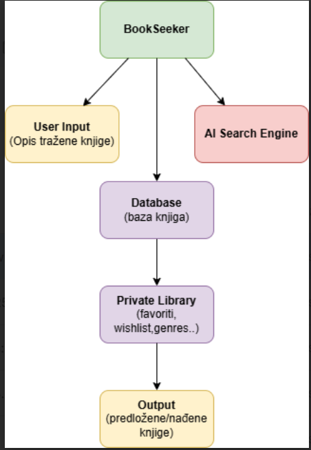

# 📚 BookSeeker — Inteligentna pretraga knjiga  - Carla Bajić

- **Project name:** BookSeeker
- **Autor / Team Leader:** Carla Bajić
- **Kolegij:** Uvod u programsko inženjerstvo
- **Folder:** students/lab03/carla3791/
- **Status:** In Progress
- **Description:** BookSeeker je osobna digitalna knjižnica i inteligentna tražilica knjiga. Korisnik može pretraživati knjige prema sjećanju na radnju, likove ili detalje, dok aplikacija organizira i prati sve odabrane knjige u privatnoj biblioteci.

## ❗Problem  
Čitatelji često pamte nijanse priče (likove, događaje, lokacije) ali ne točan naslov knjige. Tradicionalne tražilice oslanjaju se na precizne ključne riječi, što u tim slučajevima često nije dovoljno i vodi u dugotrajnu i neuspješnu pretragu.

## 💡 Hipoteza  
Omogućimo li semantičko (značenjsko) pretraživanje koristeći AI embedding modele, korisnici će brže i pouzdanije pronaći knjige na temelju opisa, bez potrebe za točnim naslovom ili autorom.

**Hipoteza:** AI-based semantic search > klasično keyword pretraživanje za scenarije „sjećanja na radnju“.

## Features
- Pretraživanje knjiga prema sjećanju na radnju, likove ili detalje
- Organizacija privatne biblioteke: favorites, wishlist, žanrovi
- Automatsko popunjavanje osnovnih podataka o knjigama

## 🛠️Funkcionalnosti (MVP)
- Pretraživanje knjiga po slobodnom opisu (tekstualni upit)
- Privatna biblioteka (favorites, wishlist, žanrovi)
- Embedding-based semantičko podudaranje
- Lako proširiv API (FastAPI)

## Project Diagram - Arhitektura sustava

## Technologies Used
- [draw.io](https://www.draw.io/), Mermaid
- Python 3
- Git/GitHub
- AI search API 
- Testiranje: **behave** (BDD)  

## 🧪Testiranje (BDD)
Projekt koristi BDD pristup:
- `.feature` datoteke (Gherkin) opisuje očekano ponašanje
- `steps` datoteke implementiraju testove koji pokreću logiku (lokalno ili preko endpointa)
Cilj: definirati očekivano ponašanje iz perspektive korisnika, pa tek onda implementirati kod.

