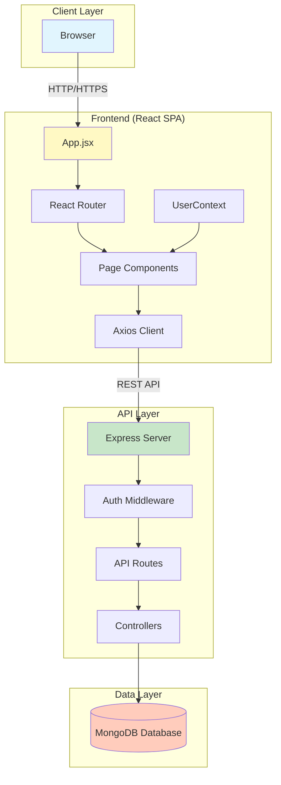
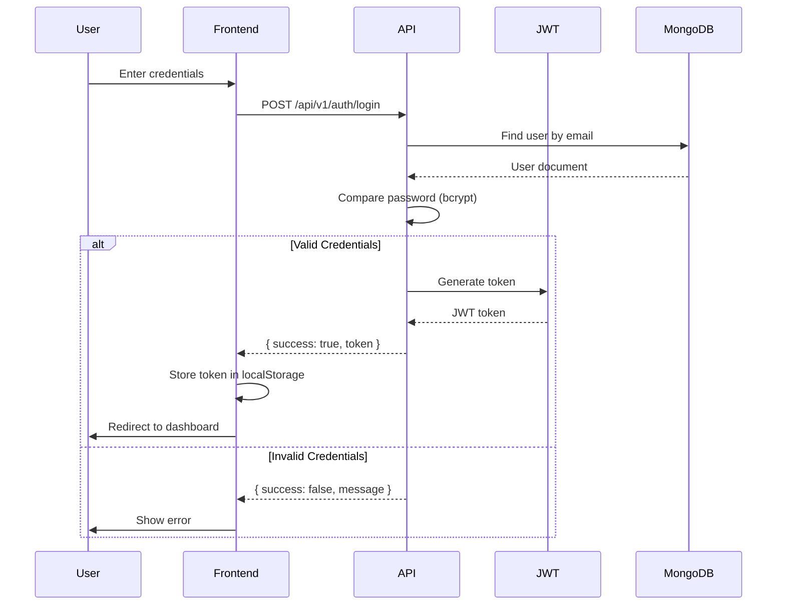
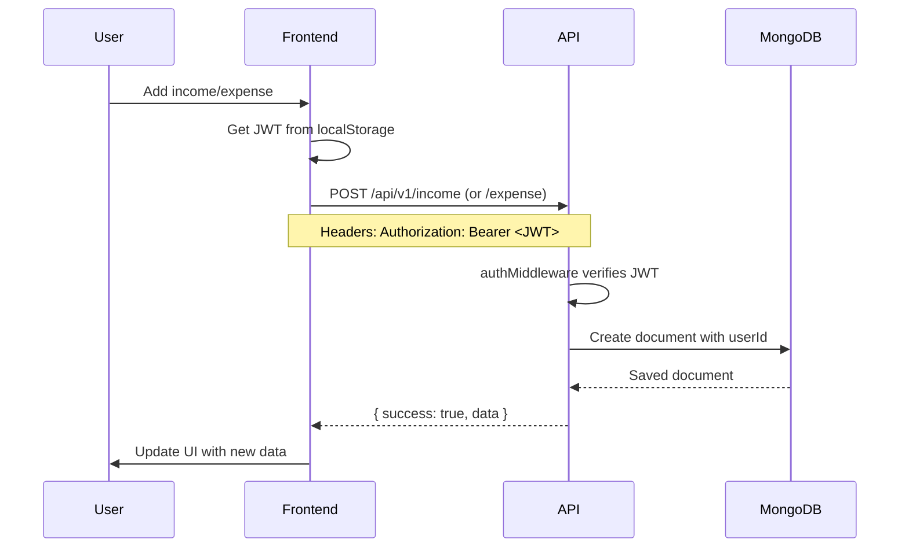
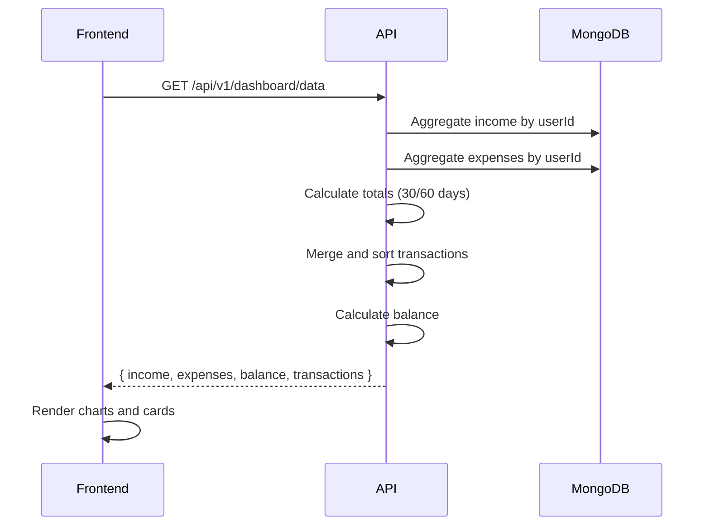
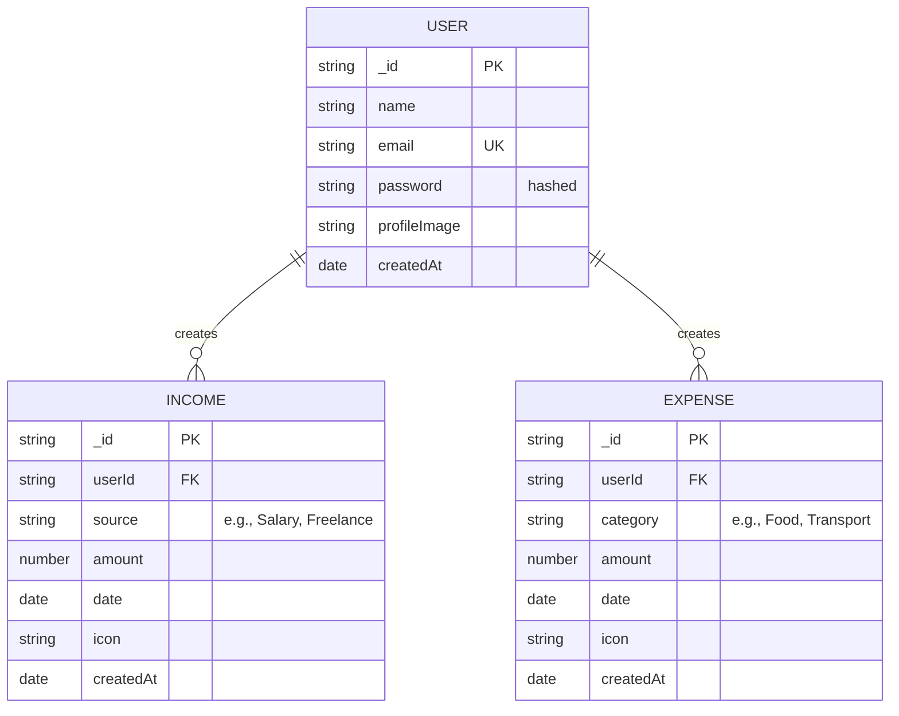
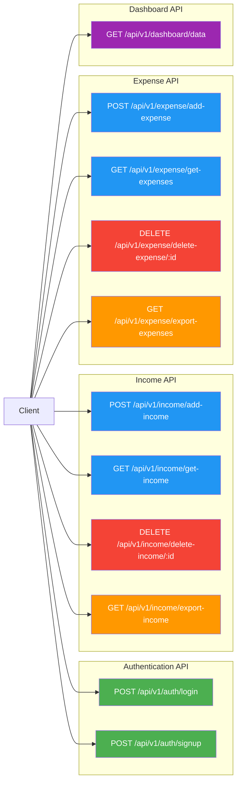
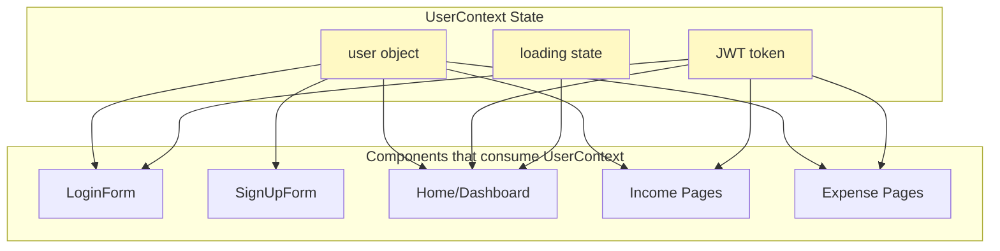

# Budgetly - Architecture Documentation

## Overview

**Budgetly** is a web application for tracking and analyzing personal finances. It helps users track spending, plan savings, and understand their financial habits through transaction analysis and data visualization.

**Tech Stack:**
- **Frontend:** React 18.3.1 + Vite 6.0.5 + Tailwind CSS 4.0.3
- **Backend:** Express.js 4.21.2 + Node.js
- **Database:** MongoDB with Mongoose 8.10.0
- **Authentication:** JWT (JSON Web Tokens) with bcryptjs

---

## High-Level Architecture



---

## Component Architecture

### Frontend Components

```mermaid
graph TD
    subgraph "Authentication Pages"
        LoginForm[LoginForm.jsx]
        SignUpForm[SignUpForm.jsx]
    end

    subgraph "Main Pages"
        Home[Home.jsx - Dashboard]
        IncomePage[Income Page]
        ExpensePage[Expense Page]
    end

    subgraph "Dashboard Components"
        FinanceOverview[FinanceOverview.jsx]
        Last30Days[Last30DaysExpenses.jsx]
        Last60Days[Last60DaysExpenses.jsx]
        SavingsGoals[SavingsGoals.jsx]
    end

    subgraph "Income Components"
        AddIncome[AddIncomeForm.jsx]
        IncomeList[IncomeList.jsx]
        IncomeOverview[IncomeOverview.jsx]
    end

    subgraph "Expense Components"
        AddExpense[AddExpenseForm.jsx]
        ExpenseList[ExpenseList.jsx]
        ExpenseOverview[ExpenseOverview.jsx]
    end

    subgraph "Shared Components"
        PieChart[PieChart.jsx]
        LineChart[LineChart.jsx]
        BarChart[BarChart.jsx]
        Card[Card.jsx]
    end

    subgraph "Context"
        UserContext[UserContext.jsx]
    end

    LoginForm --> UserContext
    SignUpForm --> UserContext
    Home --> FinanceOverview
    Home --> Last30Days
    Home --> Last60Days
    Home --> SavingsGoals
    IncomePage --> AddIncome
    IncomePage --> IncomeList
    IncomePage --> IncomeOverview
    ExpensePage --> AddExpense
    ExpensePage --> ExpenseList
    ExpensePage --> ExpenseOverview
    FinanceOverview --> PieChart
    FinanceOverview --> LineChart
    FinanceOverview --> BarChart
    Last30Days --> Card
    Last60Days --> Card
    IncomeOverview --> PieChart
    ExpenseOverview --> PieChart

    style UserContext fill:#ffe0b2
    style Home fill:#c5cae9
    style IncomePage fill:#c5cae9
    style ExpensePage fill:#c5cae9
```



### Backend Components

```mermaid
graph TD
    subgraph "Server"
        Server[server.js]
    end

    subgraph "Middleware"
        AuthMiddleware[authMiddleware.js]
        ErrorMiddleware[errorMiddleware]
        CORSMiddleware[CORS]
    end

    subgraph "Routes"
        AuthRoutes[/api/v1/auth/*]
        IncomeRoutes[/api/v1/income/*]
        ExpenseRoutes[/api/v1/expense/*]
        DashboardRoutes[/api/v1/dashboard/*]
    end

    subgraph "Controllers"
        AuthController[authController.js]
        IncomeController[incomeController.js]
        ExpenseController[expenseController.js]
        DashboardController[dashboardController.js]
    end

    subgraph "Models"
        User[User.js]
        Income[Income.js]
        Expense[Expense.js]
    end

    subgraph "Database"
        MongoDB[(MongoDB)]
    end

    Server --> AuthMiddleware
    Server --> CORSMiddleware
    Server --> ErrorMiddleware
    AuthMiddleware --> AuthRoutes
    AuthMiddleware --> IncomeRoutes
    AuthMiddleware --> ExpenseRoutes
    AuthMiddleware --> DashboardRoutes

    AuthRoutes --> AuthController
    IncomeRoutes --> IncomeController
    ExpenseRoutes --> ExpenseController
    DashboardRoutes --> DashboardController

    AuthController --> User
    IncomeController --> Income
    ExpenseController --> Expense
    DashboardController --> Income
    DashboardController --> Expense

    User --> MongoDB
    Income --> MongoDB
    Expense --> MongoDB

    style Server fill:#81c784
    style AuthMiddleware fill:#64b5f6
    style MongoDB fill:#ff8a65
```

---

## Data Flow

### Authentication Flow



### Transaction Data Flow



### Dashboard Data Aggregation Flow



---

## Database Schema



---

## API Endpoints Structure



### API Details

| Method | Endpoint | Description | Protected |
|--------|----------|-------------|-----------|
| POST | `/api/v1/auth/login` | User login | No |
| POST | `/api/v1/auth/signup` | User registration | No |
| POST | `/api/v1/income/add-income` | Add income entry | Yes |
| GET | `/api/v1/income/get-income` | Get user income | Yes |
| DELETE | `/api/v1/income/delete-income/:id` | Delete income | Yes |
| GET | `/api/v1/income/export-income` | Export income to Excel | Yes |
| POST | `/api/v1/expense/add-expense` | Add expense entry | Yes |
| GET | `/api/v1/expense/get-expenses` | Get user expenses | Yes |
| DELETE | `/api/v1/expense/delete-expense/:id` | Delete expense | Yes |
| GET | `/api/v1/expense/export-expenses` | Export expenses to Excel | Yes |
| GET | `/api/v1/dashboard/data` | Get dashboard analytics | Yes |

---

## Routing Structure

### Frontend Routes

```mermaid
graph TD
    Root[/]

    Root -->|redirect| Login[/login]
    Root -->|navigate| SignUp[/signUp]
    Root -->|protected| Dashboard[/dashboard]
    Root -->|protected| Income[/income]
    Root -->|protected| Expense[/expense]

    Dashboard --> Home[Home.jsx]
    Income --> IncomePage[Income Page]
    Expense --> ExpensePage[Expense Page]

    Login --> LoginForm[LoginForm.jsx]
    SignUp --> SignUpForm[SignUpForm.jsx]

    style Login fill:#ffcdd2
    style SignUp fill:#ffcdd2
    style Dashboard fill:#c8e6c9
    style Income fill:#c8e6c9
    style Expense fill:#c8e6c9
```

---

## State Management



---

## Project Structure

```
budgetly/
├── frontend/expense-tracker/
│   ├── public/
│   ├── src/
│   │   ├── components/
│   │   │   ├── auth/
│   │   │   ├── dashboard/
│   │   │   ├── income/
│   │   │   ├── expense/
│   │   │   └── charts/
│   │   ├── context/
│   │   │   └── UserContext.jsx
│   │   ├── pages/
│   │   ├── App.jsx
│   │   └── main.jsx
│   ├── index.html
│   ├── vite.config.js
│   ├── tailwind.config.js
│   └── package.json
│
└── backend/
    ├── config/
    │   └── db.js
    ├── controllers/
    │   ├── authController.js
    │   ├── incomeController.js
    │   ├── expenseController.js
    │   └── dashboardController.js
    ├── middleware/
    │   └── authMiddleware.js
    ├── models/
    │   ├── User.js
    │   ├── Income.js
    │   └── Expense.js
    ├── routes/
    │   ├── authRoutes.js
    │   ├── incomeRoutes.js
    │   ├── expenseRoutes.js
    │   └── dashboardRoutes.js
    ├── server.js
    └── package.json
```

---

## Environment Variables

### Backend (.env)
```bash
MONGO_URI=mongodb://localhost:27017/budgetly
JWT_SECRET=your_jwt_secret_key
CLIENT_URL=http://localhost:5173
PORT=5000
```

---

## Security Features

1. **Password Hashing:** All passwords are hashed using bcryptjs before storage
2. **JWT Authentication:** Stateless authentication using JSON Web Tokens
3. **Protected Routes:** All API endpoints (except auth) require valid JWT
4. **CORS Configuration:** Cross-origin requests restricted to client URL
5. **Input Validation:** Basic validation on API endpoints

---

## Key Features Implemented

- [x] User registration and login
- [x] JWT-based authentication
- [x] Income tracking with categories and icons
- [x] Expense tracking with categories and icons
- [x] Dashboard with financial overview
- [x] Data visualization (Pie, Line, Bar charts)
- [x] Export to Excel functionality
- [x] Profile image upload
- [x] Responsive design with Tailwind CSS

---

## Features Not Yet Implemented (Per Specification)

- [ ] AI Agent for savings recommendations
- [ ] Spending prediction algorithms
- [ ] Category-based spending alerts
- [ ] Automated financial advice based on patterns

---

## Entry Points

| Component | Path |
|-----------|------|
| Frontend Entry | `frontend/expense-tracker/src/main.jsx` |
| React Router | `frontend/expense-tracker/src/App.jsx` |
| Backend Server | `backend/server.js` |
| Database Config | `backend/config/db.js` |
