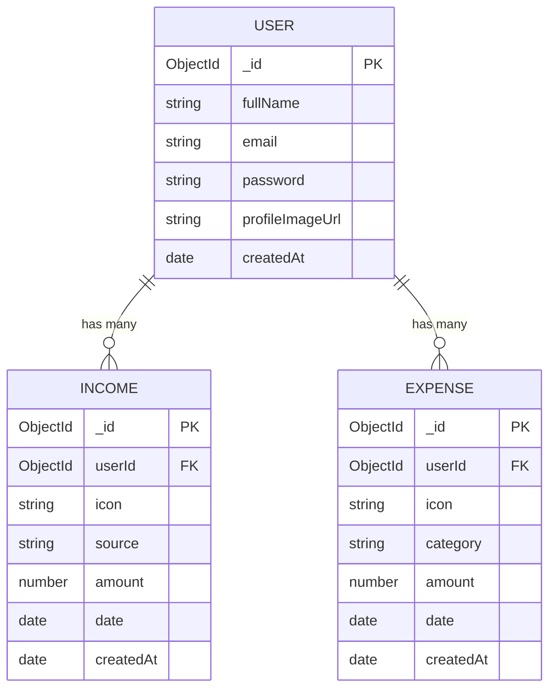
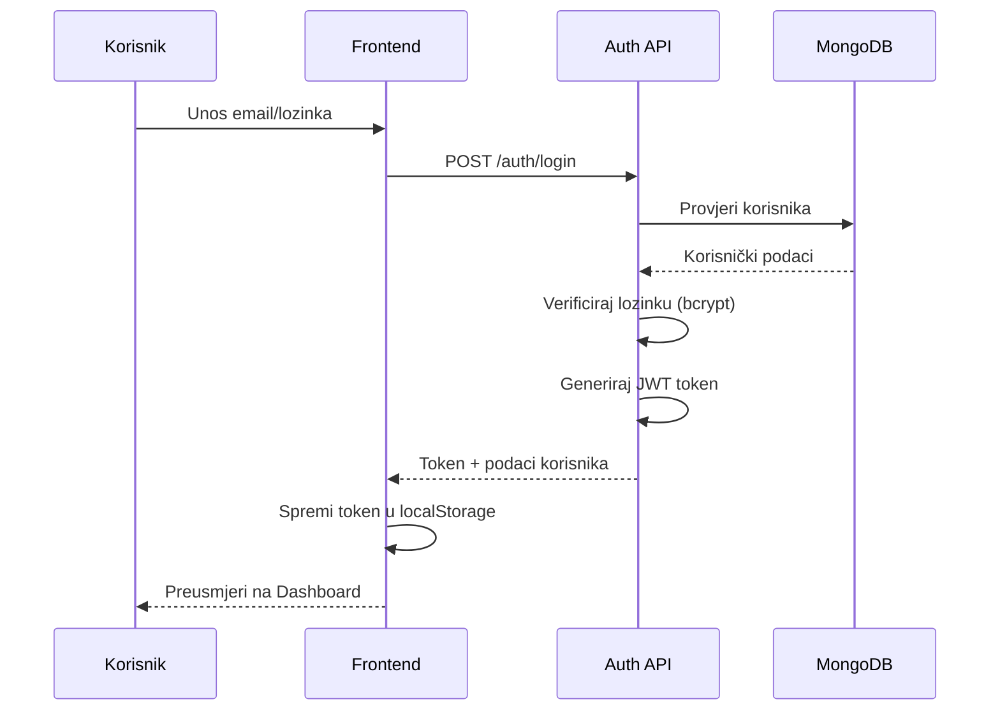
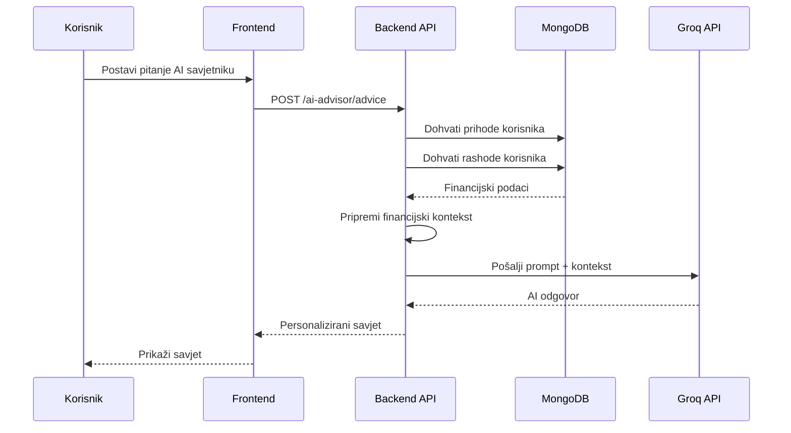
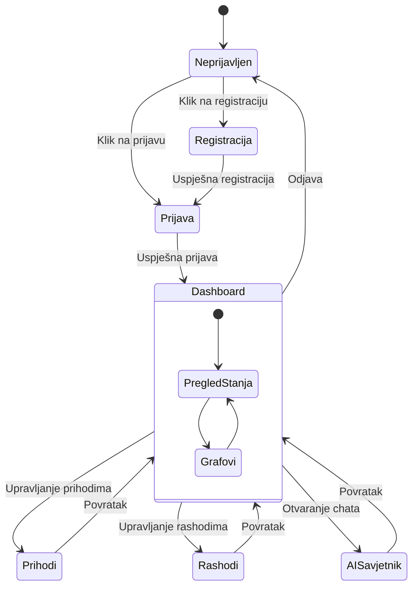

# SPECIFICATION.md

## Naziv projekta
**Budgetly - Aplikacija za praćenje i analizu osobnih financija**

---

## Problem koji Budgetly rješava

Većina ljudi nema jasan uvid u svoje financijske navike. Svakodnevni troškovi se akumuliraju bez svijesti o tome koliko se zapravo troši i na što. Posljedice toga su:

- **Nedostatak kontrole nad financijama** - korisnici ne znaju gdje im odlazi novac
- **Poteškoće sa štednjom** - bez praćenja troškova teško je odvojiti novac za štednju
- **Loše financijske odluke** - bez podataka o potrošnji, odluke se donose naslijepo
- **Neprepoznavanje obrazaca potrošnje** - ponavljajući troškovi ostaju nezamijećeni
- **Stres oko financija** - nejasnoća o financijskom stanju stvara anksioznost

**Budgetly** rješava ove probleme pružajući jednostavan alat za evidenciju prihoda i rashoda s vizualnim prikazima i AI savjetnikom koji pomaže korisnicima donijeti bolje financijske odluke.

---

## Opis projekta

Budgetly je full-stack web aplikacija koja omogućuje korisnicima praćenje osobnih financija kroz:
- Evidenciju prihoda i rashoda s kategorizacijom
- Vizualni prikaz troškova putem interaktivnih grafova
- AI savjetnika (chatbot) koji analizira korisničke podatke i daje personalizirane savjete
- Dashboard s pregledom financijskog stanja u realnom vremenu

---

## Svrha i cilj projekta

- Pomoći korisnicima da **bolje upravljaju svojim financijama**
- Omogućiti **jednostavno praćenje** prihoda i rashoda
- Vizualno prikazati troškove po kategorijama (hrana, prijevoz, zabava, režije...)
- Implementirati **AI savjetnika** koji daje personalizirane preporuke za štednju
- Pružiti **uvid u financijske obrasce** kroz analitiku i izvještaje

---

## Tehnologije

### Backend
- **Node.js** s **Express.js** frameworkom
- **MongoDB** baza podataka s **Mongoose** ODM-om
- **JWT** autentifikacija
- **Multer** za upload datoteka
- **Groq API** (Llama 3.1) za AI savjetnika

### Frontend
- **React 18** s **Vite** build toolom
- **Tailwind CSS** za stiliziranje
- **React Router** za navigaciju
- **Recharts** za vizualizaciju podataka
- **Axios** za HTTP komunikaciju

---

## Funkcionalnosti

1. **Registracija i prijava korisnika** - JWT autentifikacija 
2. **Unos prihoda** - evidentiranje izvora prihoda s iznosom i datumom
3. **Unos rashoda** - evidentiranje troškova s kategorijom, iznosom i datumom
4. **Kategorizacija troškova** - organizacija troškova po kategorijama
5. **Dashboard** - pregled ukupnog stanja, prihoda, rashoda i nedavnih transakcija
6. **Vizualni prikazi** - grafovi potrošnje po kategorijama i vremenu
7. **AI savjetnik** - chatbot koji daje personalizirane financijske savjete
8. **Brzi uvidi** - automatska analiza stope štednje i obrazaca potrošnje

---

## Funkcionalnost AI savjetnika

AI savjetnik koristi **Groq API** s **Llama 3.1-8b-instant** modelom za generiranje personaliziranih preporuka:

- Analizira korisnikove prihode, rashode i kategorije potrošnje
- Daje savjete na temelju stvarnih financijskih podataka korisnika
- Odgovara na korisnikova pitanja o financijama
- Predlaže načine uštede na temelju obrazaca potrošnje
- Komunicira na hrvatskom ili engleskom jeziku, ovisno o korisniku

### Brzi uvidi (automatski)
- Izračunava stopu štednje i daje povratnu informaciju
- Identificira kategoriju s najvećom potrošnjom
- Upozorava ako korisnik troši više nego što zarađuje

---

## Dijagrami

### ER Dijagram (Model baze podataka)



---

### Sekvencijski dijagram: Autentifikacija



---

### Sekvencijski dijagram: AI Savjetnik



---

### Dijagram stanja aplikacije



---

## Arhitektura sustava

```
┌─────────────────┐     ┌─────────────────┐     ┌─────────────────┐
│                 │     │                 │     │                 │
│  React Frontend │────▶│  Express API    │────▶│    MongoDB      │
│  (Vite + TW)    │     │  (Node.js)      │     │    Atlas        │
│                 │     │                 │     │                 │
└─────────────────┘     └────────┬────────┘     └─────────────────┘
                                 │
                                 ▼
                        ┌─────────────────┐
                        │                 │
                        │    Groq API     │
                        │  (Llama 3.1)    │
                        │                 │
                        └─────────────────┘
```

---

## API Endpoints

| Metoda | Endpoint | Opis |
|--------|----------|------|
| POST | `/api/v1/auth/register` | Registracija korisnika |
| POST | `/api/v1/auth/login` | Prijava korisnika |
| GET | `/api/v1/dashboard` | Dohvat dashboard podataka |
| GET/POST/DELETE | `/api/v1/income` | CRUD operacije za prihode |
| GET/POST/DELETE | `/api/v1/expense` | CRUD operacije za rashode |
| POST | `/api/v1/ai-advisor/advice` | AI savjetnik chat |
| GET | `/api/v1/ai-advisor/insights` | Brzi financijski uvidi |

---
