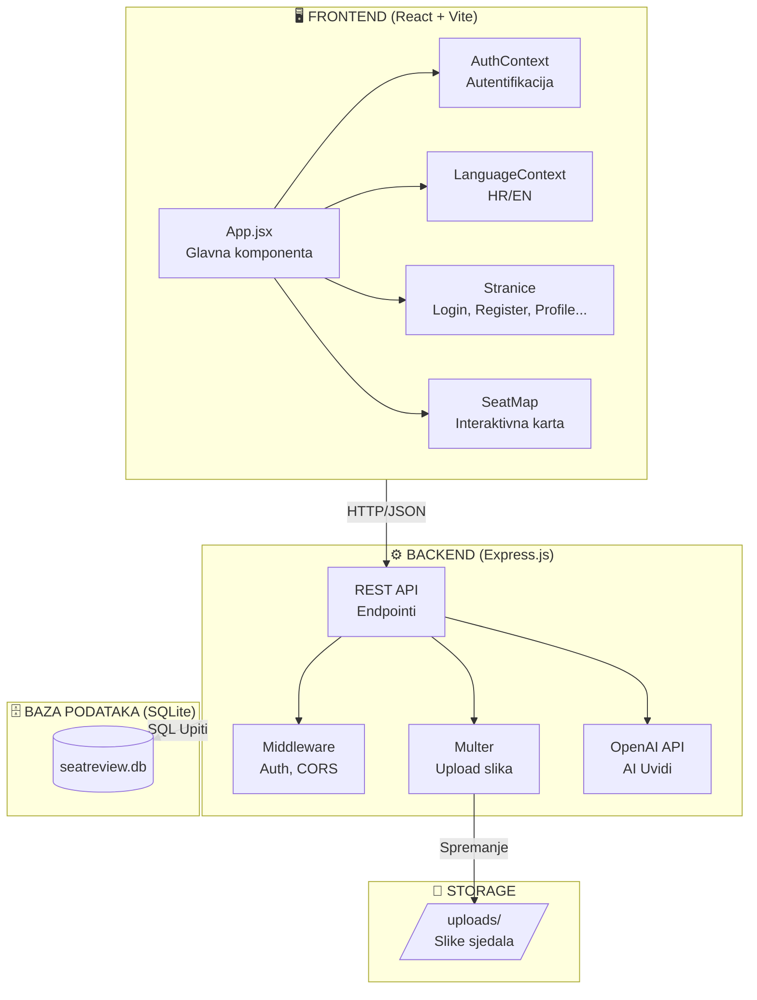
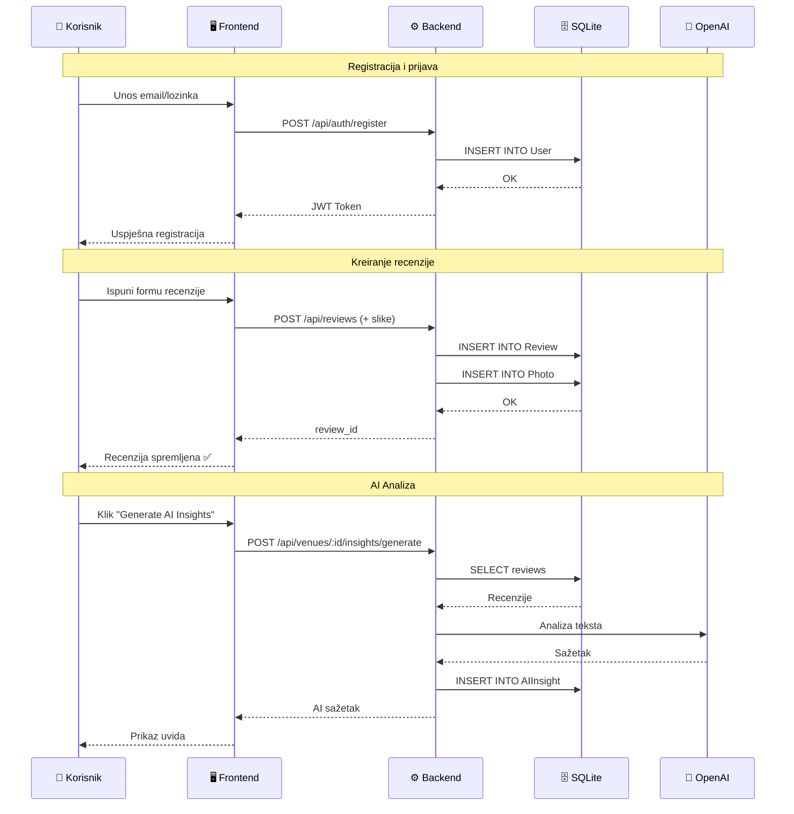
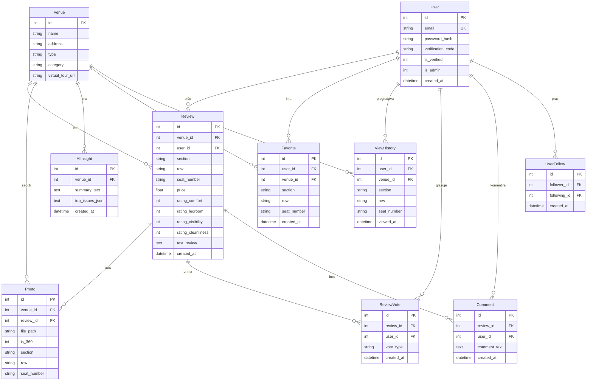
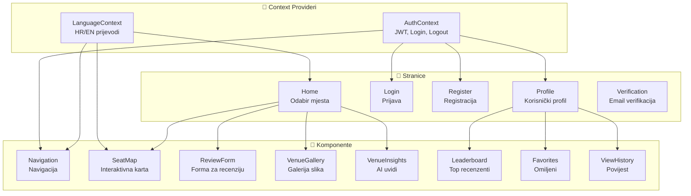
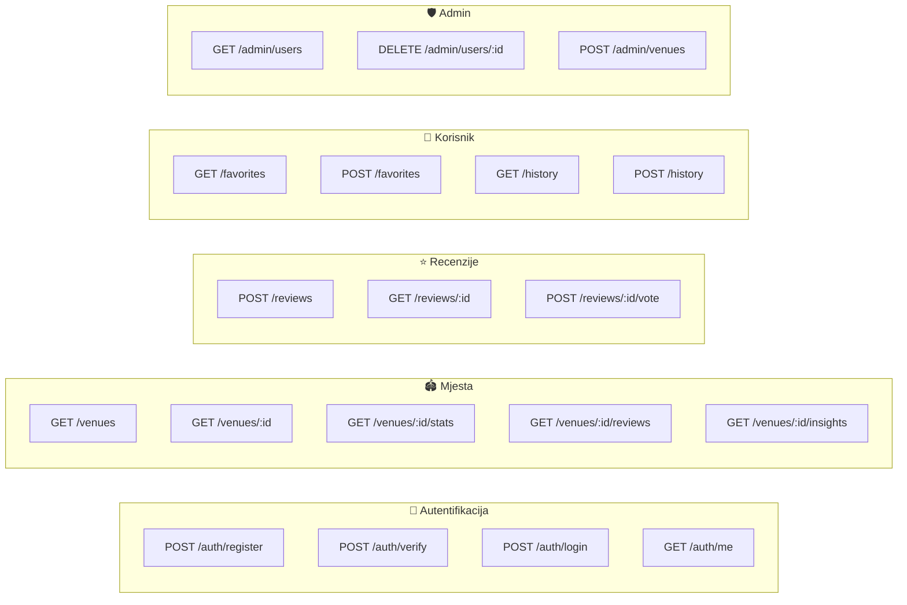
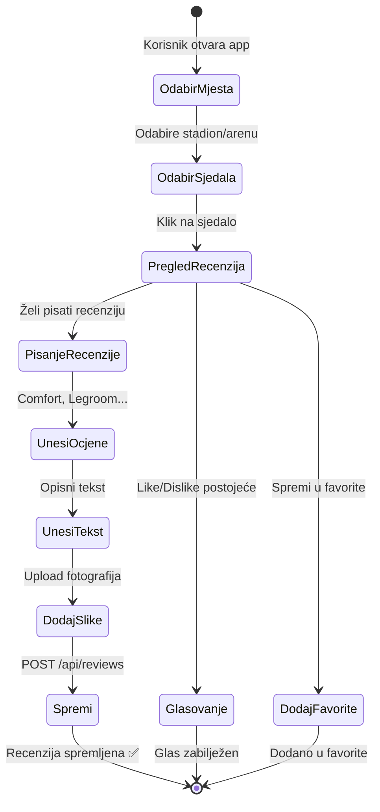
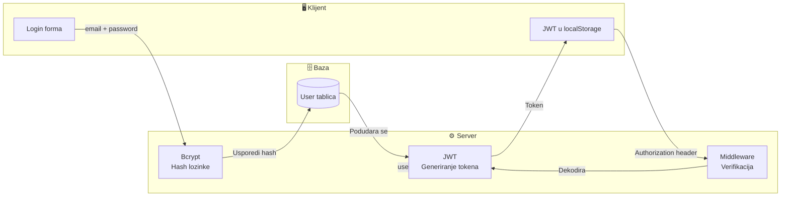

# SeatReview - Aplikacija za Recenzije Sjedala

## Pregled Projekta

SeatReview je web aplikacija koja korisnicima omogućuje pregled, ocjenjivanje i dijeljenje iskustava sa sjedalima na stadionima, arenama i kazalištima. Aplikacija pruža interaktivnu kartu sjedala, 360° virtualne ture, sustav recenzija s like/dislike funkcionalnosti, te AI-generirane uvide.

---

## Arhitektura Aplikacije

```
┌─────────────────────────────────────────────────────────────────┐
│                        FRONTEND (React)                          │
│  ┌─────────────┐  ┌─────────────┐  ┌─────────────────────────┐  │
│  │   App.jsx   │  │  SeatMap    │  │  AuthContext/Language   │  │
│  │  (Router)   │  │  (Mapa)     │  │  Context (Stanje)       │  │
│  └──────┬──────┘  └──────┬──────┘  └───────────┬─────────────┘  │
│         │                │                      │                 │
│         └────────────────┴──────────────────────┘                 │
│                          │                                        │
│                    HTTP API Pozivi                                │
│                          │                                        │
└──────────────────────────┼────────────────────────────────────────┘
                           │
                           ▼
┌─────────────────────────────────────────────────────────────────┐
│                      BACKEND (Express.js)                        │
│  ┌─────────────┐  ┌─────────────┐  ┌─────────────────────────┐  │
│  │   REST API  │  │   Auth      │  │   Multer (Upload)       │  │
│  │  Endpoints  │  │ Middleware  │  │   OpenAI Integration    │  │
│  └──────┬──────┘  └──────┬──────┘  └───────────┬─────────────┘  │
│         │                │                      │                 │
│         └────────────────┴──────────────────────┘                 │
│                          │                                        │
│                    SQLite Upiti                                   │
│                          │                                        │
└──────────────────────────┼────────────────────────────────────────┘
                           │
                           ▼
┌─────────────────────────────────────────────────────────────────┐
│                    BAZA PODATAKA (SQLite)                        │
│  ┌─────────┐ ┌─────────┐ ┌─────────┐ ┌─────────┐ ┌───────────┐  │
│  │  User   │ │  Venue  │ │ Review  │ │  Photo  │ │ReviewVote │  │
│  └─────────┘ └─────────┘ └─────────┘ └─────────┘ └───────────┘  │
│  ┌─────────┐ ┌─────────┐ ┌─────────┐ ┌─────────┐ ┌───────────┐  │
│  │Favorite │ │ViewHist.│ │ Comment │ │UserFollow│ │ AIInsight │  │
│  └─────────┘ └─────────┘ └─────────┘ └─────────┘ └───────────┘  │
└─────────────────────────────────────────────────────────────────┘
```

---

## Struktura Direktorija

```
probna vezija app 3/
├── backend/
│   ├── index.mjs           # Glavni server file (Express.js)
│   ├── package.json        # Backend dependencies
│   ├── .env.example        # Primjer environment varijabli
│   ├── db/
│   │   └── seatreview.db   # SQLite baza podataka
│   └── uploads/            # Uploadane slike
│
├── frontend/
│   ├── src/
│   │   ├── App.jsx              # Glavna komponenta aplikacije
│   │   ├── main.jsx             # Entry point
│   │   ├── AuthContext.jsx      # Autentifikacija context
│   │   ├── LanguageContext.jsx  # Višejezičnost context
│   │   ├── Navigation.jsx       # Navigacijska komponenta
│   │   ├── Login.jsx            # Login forma
│   │   ├── Register.jsx         # Registracija s validacijom lozinke
│   │   ├── Verification.jsx     # Email verifikacija
│   │   ├── Profile.jsx          # Korisnički profil
│   │   ├── SeatMap.jsx          # Interaktivna karta sjedala
│   │   ├── Favorites.jsx        # Omiljena sjedala
│   │   ├── ViewHistory.jsx      # Povijest pregledavanja
│   │   ├── Leaderboard.jsx      # Top recenzenti
│   │   ├── translations.js      # Prijevodi (HR/EN)
│   │   └── styles.css           # Stilovi
│   ├── index.html
│   ├── package.json
│   └── vite.config.mjs
│
└── README.md
```

---

## Baza Podataka - Shema

### ER Dijagram

```
┌─────────────┐       ┌─────────────┐       ┌─────────────┐
│    User     │       │   Venue     │       │   Review    │
├─────────────┤       ├─────────────┤       ├─────────────┤
│ id (PK)     │       │ id (PK)     │       │ id (PK)     │
│ email       │       │ name        │       │ venue_id(FK)│
│ password_   │       │ address     │       │ user_id(FK) │
│   hash      │       │ type        │       │ section     │
│ verification│       │ category    │       │ row         │
│   _code     │       │ virtual_    │       │ seat_number │
│ is_verified │       │   tour_url  │       │ price       │
│ is_admin    │       └──────┬──────┘       │ rating_*    │
│ created_at  │              │              │ text_review │
└──────┬──────┘              │              │ created_at  │
       │                     │              └──────┬──────┘
       │                     │                     │
       │         ┌───────────┴───────────┐         │
       │         │                       │         │
       ▼         ▼                       ▼         ▼
┌─────────────┐ ┌─────────────┐  ┌─────────────┐ ┌─────────────┐
│  Favorite   │ │   Photo     │  │ ReviewVote  │ │  Comment    │
├─────────────┤ ├─────────────┤  ├─────────────┤ ├─────────────┤
│ id (PK)     │ │ id (PK)     │  │ id (PK)     │ │ id (PK)     │
│ user_id(FK) │ │ venue_id(FK)│  │ review_id   │ │ review_id   │
│ venue_id(FK)│ │ review_id   │  │   (FK)      │ │   (FK)      │
│ section     │ │   (FK)      │  │ user_id(FK) │ │ user_id(FK) │
│ row         │ │ file_path   │  │ vote_type   │ │ comment_text│
│ seat_number │ │ is_360      │  │ created_at  │ │ created_at  │
│ created_at  │ │ section     │  └─────────────┘ └─────────────┘
└─────────────┘ │ row         │
                │ seat_number │
                └─────────────┘

┌─────────────┐ ┌─────────────┐ ┌─────────────┐
│ ViewHistory │ │ UserFollow  │ │  AIInsight  │
├─────────────┤ ├─────────────┤ ├─────────────┤
│ id (PK)     │ │ id (PK)     │ │ id (PK)     │
│ user_id(FK) │ │ follower_id │ │ venue_id(FK)│
│ venue_id(FK)│ │   (FK)      │ │ summary_text│
│ section     │ │ following_id│ │ top_issues_ │
│ row         │ │   (FK)      │ │   json      │
│ seat_number │ │ created_at  │ │ created_at  │
│ viewed_at   │ └─────────────┘ └─────────────┘
└─────────────┘
```

### Detaljan Opis Tablica

#### 1. User (Korisnici)
```sql
CREATE TABLE User (
  id INTEGER PRIMARY KEY AUTOINCREMENT,
  email TEXT UNIQUE NOT NULL,
  password_hash TEXT NOT NULL,
  verification_code TEXT,
  is_verified INTEGER DEFAULT 0,
  is_admin INTEGER DEFAULT 0,
  created_at TEXT DEFAULT (datetime('now'))
);
```
- **Svrha**: Pohranjuje korisničke račune
- **password_hash**: Bcrypt hashirana lozinka (min 8 znakova, veliko/malo slovo, broj, specijalni znak)
- **is_admin**: 1 = admin korisnik s dodatnim pravima

#### 2. Venue (Mjesta/Stadioni)
```sql
CREATE TABLE Venue (
  id INTEGER PRIMARY KEY AUTOINCREMENT,
  name TEXT NOT NULL,
  address TEXT,
  type TEXT,
  category TEXT DEFAULT 'stadium',
  virtual_tour_url TEXT
);
```
- **Svrha**: Pohranjuje stadione, arene i kazališta
- **category**: 'stadium' ili 'arena'
- **virtual_tour_url**: URL za 360° virtualnu šetnju (Matterport)

#### 3. Review (Recenzije)
```sql
CREATE TABLE Review (
  id INTEGER PRIMARY KEY AUTOINCREMENT,
  venue_id INTEGER NOT NULL,
  user_id INTEGER NOT NULL,
  section TEXT,
  row TEXT,
  seat_number TEXT,
  price REAL,
  rating_comfort INTEGER,
  rating_legroom INTEGER,
  rating_visibility INTEGER,
  rating_cleanliness INTEGER,
  text_review TEXT,
  created_at TEXT DEFAULT (datetime('now')),
  FOREIGN KEY (venue_id) REFERENCES Venue(id),
  FOREIGN KEY (user_id) REFERENCES User(id)
);
```
- **Svrha**: Korisničke recenzije sjedala
- **rating_***: Ocjene od 1-5 za različite aspekte
- **price**: Cijena karte u eurima

#### 4. ReviewVote (Glasovi za recenzije)
```sql
CREATE TABLE ReviewVote (
  id INTEGER PRIMARY KEY AUTOINCREMENT,
  review_id INTEGER NOT NULL,
  user_id INTEGER NOT NULL,
  vote_type TEXT NOT NULL CHECK(vote_type IN ('like', 'dislike')),
  created_at TEXT DEFAULT (datetime('now')),
  FOREIGN KEY (review_id) REFERENCES Review(id),
  FOREIGN KEY (user_id) REFERENCES User(id),
  UNIQUE(review_id, user_id)
);
```
- **Svrha**: Like/Dislike sustav za recenzije
- **UNIQUE constraint**: Jedan korisnik može glasati jednom po recenziji

#### 5. Photo (Fotografije)
```sql
CREATE TABLE Photo (
  id INTEGER PRIMARY KEY AUTOINCREMENT,
  venue_id INTEGER,
  review_id INTEGER,
  file_path TEXT NOT NULL,
  is_360 INTEGER DEFAULT 0,
  section TEXT,
  row TEXT,
  seat_number TEXT,
  FOREIGN KEY (venue_id) REFERENCES Venue(id),
  FOREIGN KEY (review_id) REFERENCES Review(id)
);
```
- **Svrha**: Pohranjuje slike sjedala
- **is_360**: 1 = 360° panoramska slika

#### 6. Favorite (Favoriti)
```sql
CREATE TABLE Favorite (
  id INTEGER PRIMARY KEY AUTOINCREMENT,
  user_id INTEGER NOT NULL,
  venue_id INTEGER,
  section TEXT,
  row TEXT,
  seat_number TEXT,
  created_at TEXT DEFAULT (datetime('now')),
  FOREIGN KEY (user_id) REFERENCES User(id),
  FOREIGN KEY (venue_id) REFERENCES Venue(id),
  UNIQUE(user_id, venue_id, section, row, seat_number)
);
```
- **Svrha**: Korisnikova omiljena sjedala

#### 7. ViewHistory (Povijest pregledavanja)
```sql
CREATE TABLE ViewHistory (
  id INTEGER PRIMARY KEY AUTOINCREMENT,
  user_id INTEGER NOT NULL,
  venue_id INTEGER NOT NULL,
  section TEXT,
  row TEXT,
  seat_number TEXT,
  viewed_at TEXT DEFAULT (datetime('now')),
  FOREIGN KEY (user_id) REFERENCES User(id),
  FOREIGN KEY (venue_id) REFERENCES Venue(id)
);
```
- **Svrha**: Praćenje koje su sjedala korisnici pregledali

#### 8. Comment (Komentari)
```sql
CREATE TABLE Comment (
  id INTEGER PRIMARY KEY AUTOINCREMENT,
  review_id INTEGER NOT NULL,
  user_id INTEGER NOT NULL,
  comment_text TEXT NOT NULL,
  created_at TEXT DEFAULT (datetime('now')),
  FOREIGN KEY (review_id) REFERENCES Review(id),
  FOREIGN KEY (user_id) REFERENCES User(id)
);
```
- **Svrha**: Komentari na recenzije

#### 9. UserFollow (Praćenje korisnika)
```sql
CREATE TABLE UserFollow (
  id INTEGER PRIMARY KEY AUTOINCREMENT,
  follower_id INTEGER NOT NULL,
  following_id INTEGER NOT NULL,
  created_at TEXT DEFAULT (datetime('now')),
  FOREIGN KEY (follower_id) REFERENCES User(id),
  FOREIGN KEY (following_id) REFERENCES User(id),
  UNIQUE(follower_id, following_id)
);
```
- **Svrha**: Sustav praćenja korisnika (follow)

#### 10. AIInsight (AI Uvidi)
```sql
CREATE TABLE AIInsight (
  id INTEGER PRIMARY KEY AUTOINCREMENT,
  venue_id INTEGER NOT NULL,
  summary_text TEXT,
  top_issues_json TEXT,
  created_at TEXT DEFAULT (datetime('now')),
  FOREIGN KEY (venue_id) REFERENCES Venue(id)
);
```
- **Svrha**: AI-generirane analize recenzija (OpenAI GPT)

---

## API Endpointi

### Autentifikacija
| Metoda | Endpoint | Opis |
|--------|----------|------|
| POST | `/api/auth/register` | Registracija novog korisnika |
| POST | `/api/auth/verify` | Verifikacija email koda |
| POST | `/api/auth/login` | Prijava korisnika |
| GET | `/api/auth/me` | Dohvat profila trenutnog korisnika |

### Venues (Mjesta)
| Metoda | Endpoint | Opis |
|--------|----------|------|
| GET | `/api/venues` | Dohvat svih mjesta (filter: ?category=) |
| GET | `/api/venues/:id` | Dohvat pojedinog mjesta |
| GET | `/api/venues/:id/stats` | Statistika mjesta |
| GET | `/api/venues/:id/reviews` | Recenzije mjesta |
| GET | `/api/venues/:id/gallery` | Galerija slika |
| GET | `/api/venues/:id/360-photos` | 360° fotografije |
| GET | `/api/venues/:id/seats` | Sjedala s cijenama i ocjenama |
| GET | `/api/venues/:id/best-seat` | Najbolje sjedalo za budžet |
| GET | `/api/venues/:id/insights` | AI uvidi |

### Recenzije
| Metoda | Endpoint | Opis |
|--------|----------|------|
| POST | `/api/reviews` | Kreiranje recenzije (auth) |
| GET | `/api/reviews/:id` | Dohvat recenzije |
| POST | `/api/reviews/:id/vote` | Glasanje (like/dislike) |
| GET | `/api/reviews/:id/votes` | Broj glasova |
| GET | `/api/reviews/:id/my-vote` | Korisnikov glas |

### Favoriti & Povijest
| Metoda | Endpoint | Opis |
|--------|----------|------|
| GET | `/api/favorites` | Dohvat favorita |
| POST | `/api/favorites` | Dodaj u favorite |
| DELETE | `/api/favorites` | Ukloni iz favorita |
| GET | `/api/history` | Povijest pregledavanja |
| POST | `/api/history` | Dodaj u povijest |

### Admin
| Metoda | Endpoint | Opis |
|--------|----------|------|
| GET | `/api/admin/users` | Svi korisnici |
| PUT | `/api/admin/users/:id/toggle-admin` | Promijeni admin status |
| DELETE | `/api/admin/users/:id` | Obriši korisnika |
| POST | `/api/admin/venues` | Kreiraj mjesto |
| PUT | `/api/admin/venues/:id` | Ažuriraj mjesto |
| DELETE | `/api/admin/venues/:id` | Obriši mjesto |

---

## Tehnologije

### Frontend
- **React 18** - UI library
- **Vite 5** - Build tool
- **React Router 6** - Routing
- **CSS3** - Stilizacija

### Backend
- **Node.js** - Runtime
- **Express.js 4** - Web framework
- **SQLite3** - Baza podataka
- **JWT** - Autentifikacija
- **Bcrypt** - Hashiranje lozinki
- **Multer** - Upload datoteka
- **Nodemailer** - Slanje emailova
- **OpenAI API** - AI uvidi

---

## Glavne Funkcionalnosti

1. **Interaktivna Karta Sjedala** - Vizualni prikaz sjedala s ocjenama i cijenama
2. **360° Virtualne Ture** - Matterport integracija za stadione (npr. Stadion Poljud)
3. **Sustav Recenzija** - Ocjenjivanje udobnosti, prostora za noge, vidljivosti, čistoće
4. **Like/Dislike** - Glasovanje za korisne recenzije
5. **Favoriti** - Spremanje omiljenih sjedala
6. **Povijest** - Praćenje pregledanih sjedala
7. **Leaderboard** - Top recenzenti
8. **AI Uvidi** - GPT-generirane analize
9. **Višejezičnost** - Hrvatski i Engleski
10. **Admin Panel** - Upravljanje korisnicima i mjestima

---

## Autori

- Ivan Tavic (itavic371)
- Ante Susnjar (asusnjar)
- Luka Tesic (ltesic)
- Josip Cesljar (jcesljar)

---

## Licenca

MIT License

---

## Mermaid Dijagrami

### Arhitektura Sustava



### Tok Podataka (Data Flow)



### ER Dijagram Baze Podataka



### Komponente Frontend-a



### API Endpointi - Pregled



### Proces Recenziranja



### Sigurnosni Tok



---

### Kako Čitati Mermaid Dijagrame

Mermaid dijagrami se automatski renderiraju na:
- **GitHub** - u README.md i drugim .md datotekama
- **GitLab** - ugrađena podrška
- **VS Code** - s ekstenzijom "Markdown Preview Mermaid Support"
- **Online** - na [mermaid.live](https://mermaid.live)

Ako vidite samo kod umjesto dijagrama, koristite neku od navedenih opcija za prikaz.
