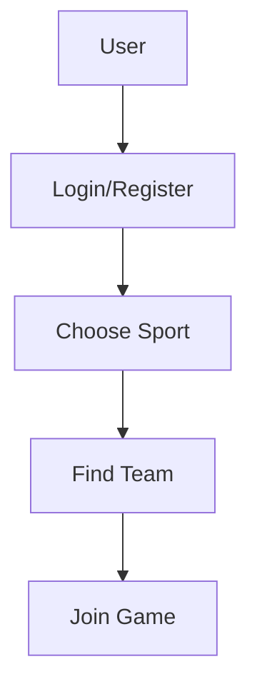

# TeamConnect - Đana Rogulj & Karolina Mihaljević

**Projekt:** TeamConnect – Povezivanje timova za sport  
**Tim:** Đana Rogulj & Karolina Mihaljević  
**Status:** U izradi  

## 🎯 Pregled projekta

**TeamConnect** je web aplikacija koja povezuje sportaše i rekreativce po **lokaciji i sportu**.  
Rješavanje problema poput npr.Ljudi često žele igrati nogomet, ali ne mogu pronaći dovoljno suigrača.
Cilj je omogućiti korisnicima da se jednostavno registriraju, odaberu sport te pronađu tim ili suigrače u **blizini svog kvarta (npr. Split, kvartovi)**.  
Ako korisnici imaju mogućnost pretraživanja timova po sportu i lokaciji, lakše će pronaći suigrače i povećati broj sportskih aktivnosti.

**Logika aplikacije**: registracija → odabir sporta → prikaz timova → spajanje u tim

Aplikacija pomaže svima koji:
- žele igrati, ali nemaju dovoljno ljudi za ekipu,  
- traže sportske aktivnosti u svom području,  
- žele se pridružiti postojećim timovima ili ligama.  

## 👥 Informacije o timu

- **Đana Rogulj** – GitHub: [@danrog101](https://github.com/danrog101)   
- **Karolina Mihaljević** – GitHub: [@Karoll47](https://github.com/Karoll47)   
- **Ime tima:** TeamConnect  

## 🛠 Korištene tehnologije

- HTML, CSS, JavaScript  
- Node.js (backend)  
- Express.js (API)  
- MongoDB ili JSON datoteke (pohrana korisnika i timova)  
- Git & GitHub (verzioniranje koda)  
- Visual Studio Code  

## 📋 Funkcionalnosti

- Registracija i login korisnika
- Odabir sporta i lokacije
- Pregled dostupnih timova
- Automatsko spajanje u timove
- Upravljanje korisničkim profilom


## 🚀 Dijagram


### Za članove tima

1. **Kloniraj repozitorij**:
   ```bash
   git clone [URL-repozitorija]
   cd 2025-intro-swe/projects/teamconnect-danrog101-Karoll47

