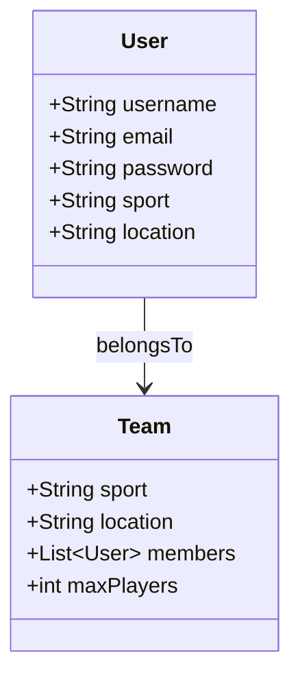
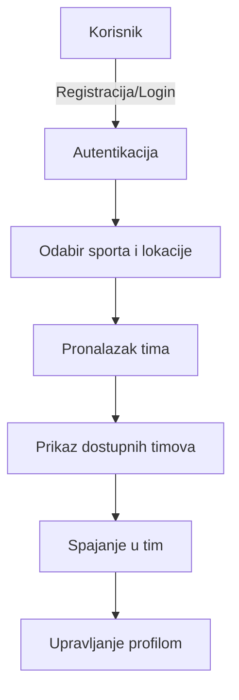
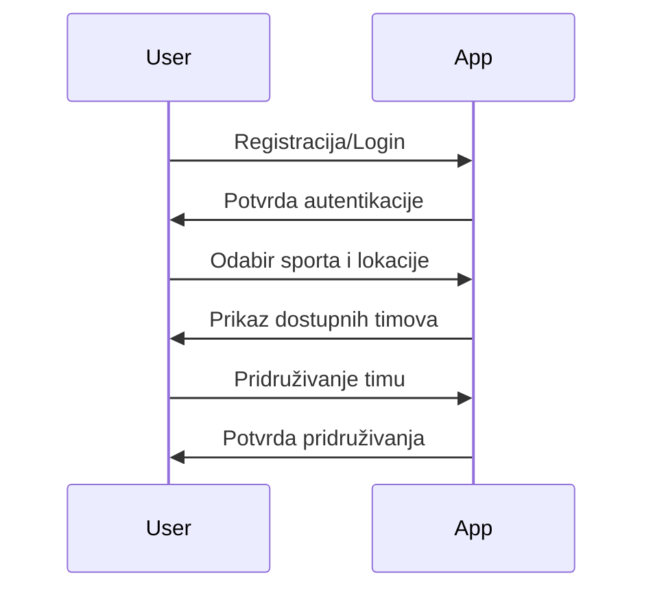

# TeamConnect - SPECIFICATION

**Course:** Uvod u programsko inženjerstvo  
**Project:** TeamConnect  
**Team:** Đana Rogulj & Karolina Mihaljević  
**Status:** U izradi

---

## 🧩 Uvod

Ovaj dokument opisuje tehničku specifikaciju projekta **TeamConnect**, web aplikacije koja omogućuje korisnicima da pronađu i formiraju sportske timove prema lokaciji i sportu.  
Dokument definira korisničke i sustavske zahtjeve, arhitekturu, podatkovni model i tijek rada aplikacije.

---

## 1️⃣ User Requirements (Korisnički zahtjevi)

- Korisnici se mogu registrirati i prijaviti  
- Korisnici mogu odabrati sport i lokaciju (Split, kvart)  
- Aplikacija automatski spaja korisnike u timove ako im fali igrača  
- Prikaz dostupnih timova po sportu i lokaciji  
- Korisnici mogu upravljati svojim profilom  

---

## 2️⃣ System Requirements (Zahtjevi sustava)

- Backend podržava registraciju, autentikaciju i pohranu korisnika  
- Baza podataka pohranjuje informacije o korisnicima i timovima  
- Sustav automatski kreira timove na temelju dostupnih korisnika i kvarta  
- Frontend omogućuje pregled i filtriranje timova po sportu i lokaciji  
- Logika spajanja u timove mora biti skalabilna i brza  

---

## 3️⃣ Software Specification (Specifikacija programske potpore)

### 3.1 Data Model

